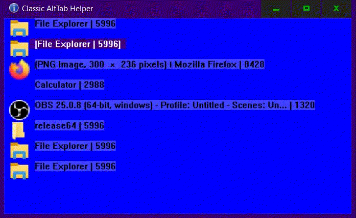


Classic AltTab
===================================

	Similarly to the built-in Alt-Tab feature in Windows,
	shows a menu that allows selecting the window to switch to.
	Configured to use key combinations Win+Tilde and Win+Shift+Tilde to
	navigate in the list of current windows on the desktop.
	
	Unlike Windows Alt-Tab feature, it only show simple list of winndows
	as icons and text. It doesn't group windows of the same type
	or from the same process. The list is one-dimensional, 
	which should make navigation fast and simple.

	

FAQ
------------

	Q: How to close and disable this tool?
	
	A1:
		Click on its icon in the tray area and close the window.
  	A2:
		Use mouse cursor to close the window.
	A3:
		While in the main window, press the 'Q' key.

Command Line Options
-------------------------

	Use following command line options to configure some parts 
	of apperance or functionality.
	
	-color_spec TEXT
	
		Set up the apperance by changing the colors of the main window.
		Text should consist of 5 colors as the semicolon separated list.
		Each color must specify 3 color components: Red, Green and Blue.
		Example:
			-color_spec "128,128,128; 255,0,0; 255,255,0; 0,0,255; 0,99,0;"
	
	-bStartVisible 0|1  --  Default: 0
	
		If set to 1 shows, the main window with the list visible on 
		startup. It will dissapear and continue to function normally 
		on the first window switch.
		
	-bTopmost 0|1  --  Default: 1
	
		Set to 0 to cause main window not set itself to the Top-Most
		window on the desktp. Not recommended to use. For test purposes.
	
	-bTrayIcon 0|1  --  Default: 1
		
		Set to 0 to disable the tray icon functionality.
		Tray icon can be used to easiliy show the main window,
		which in turn may be used to close and disable this tool.

	-nWinListOmitMode 0|7|10  --  Default: 10
	
		Mode to use. Ie. use 10 on Windows 10, and 7 on Windows 7.
		Setting this to 0 disables window omiting which will cause
		many, possibly unwamted, windows appear on the tabbing list.
	
	-bPrintWndNames2 0|1  --  Default: 0
	
		Debug purpose. Print all window names to the Stdout while tabbing.
	
	-bShowExeName 0|1  --  Default: 0
			
		Show executable name of the window in its item name in the tabbing list.
		
	-nMaxTitleLen INT  --  Default: 64
	
		Maximum length of the window text in the tabbing list.
	
	-anLabelSeparator STR  --  Default: "|"
	
		Separator text in the tabbing list.

	-anHKAltTab STR       --  Default: "8,192"
	-anHKAltShiftTab STR  --  Default: "12,192"
		
		Hotkey combinations that trigger the new alttab and altshifttab.
		It must specify two values, separated with comma.
		First spcifies the modkey combination, as OR-ed values, 
		which can be on or more flags set.
		Values of 1,2,4 and 8 stand for Alt, Control, Shift and Winkey keys, respectivelly.
		Second value is the keyboard key code, the virtual key code from the Winapi documentation.
		Eg. 192 is the tilde (aka. grave aka. accent) key.
		-anHKAltTab is the one that simulates alternate Alt+Tab.
		-anHKAltShiftTab is the one that simulates alternate Alt+Shift+Tab.
		
		Either must not specify the key combination that is already
		used by the system or other application.
		
		
About
-----------------
	Author: ike9000
	URL: https://github.com/ike9000e/Classic-AltTab
