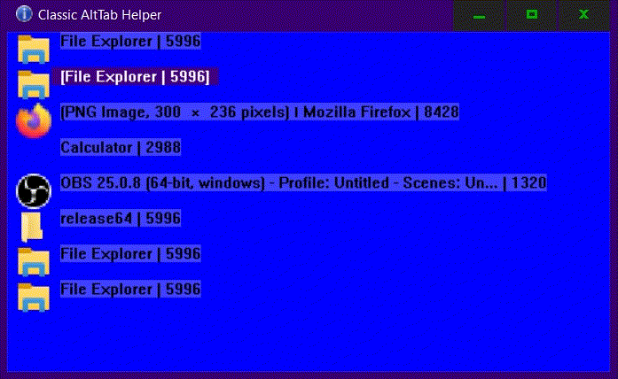



===================================
Classic AltTab
===================================

	Similarly to the built-in Alt-Tab feature in Windows,
	shows a menu that allows selecting the window to switch to.
	Configured to use key combinations Win+Tab and Win+Shift+Tab to
	navigate in the list of current windows on the desktop.
	
	Unlike Windows Alt-Tab feature, it only show simple list of winndows
	as icons and text. It doesn't group windows of the same type
	or from the same process. The list is one-dimensional, 
	which should make navigation fast and simple.

FAQ
------------

	Q: How to close and disable this tool?
	
	A1:
		Click on its icon in the tray area and close the window.
	A2:
		After pressed the Win+Tab key combination,
		release the Tab key, then press the 'Q' key.
		I.e. press the 'Q' key when the main window is opened.
	A3:
		Just like in A2, use mouse cursor to close the window.

Command Line Options
-------------------------

	Use following command line options to configure some parts 
	of apperance or functionality.
	
	-color_spec TEXT
	
		Set up the apperance by changing the colors of the main window.
		Text should consist of 5 colors as the semicolon separated list.
		Each color must specify 3 color components: Red, Green and Blue.
		Example:
			-color_spec "128,128,128; 255,0,0; 255,255,0; 0,0,255; 0,99,0;"
	
	-bStartVisible 0|1  --  Default: 0
	
		If set to 1 shows, the main window with the list visible on 
		startup. It will dissapear and continue to function normally 
		on the first window switch.
		
	-bTopmost 0|1  --  Default: 1
	
		Set to 0 to cause main window not set itself to the Top-Most
		window on the desktp. Not recommended to use. For test purposes.
	
	-bTrayIcon 0|1  --  Default: 1
		
		Set to 0 to disable the tray icon functionality.
		Tray icon can be used to easiliy show the main window,
		which in turn may be used to close and disable this tool.

About
-----------------
	Author: ike9000
	URL: https://github.com/ike9000e/Classic-AltTab
